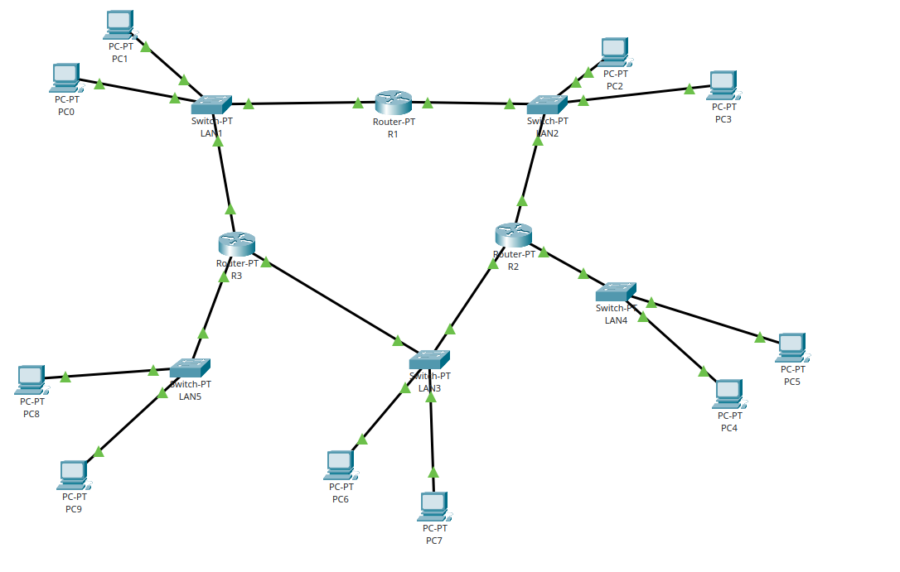
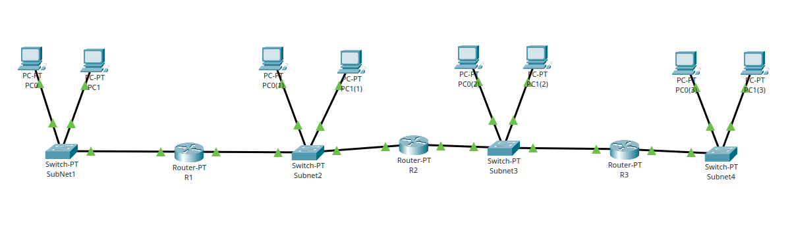

# TP Exercice TD - Sous-réseau Réseau

## Subdivision du Réseau

Le réseau a été divisé comme suit :

| LAN   | Préfixe | Masque de Sous-réseau| CIDR | Adresse Réseau | Adresse Broadcast | Plage d’Hôtes                 | Passerelle par défaut|
|-------|---------|----------------------|------|----------------|-------------------|-------------------------------|----------------------|
| LAN 1 | 0       | 255.255.255.128      | /25  | 192.168.0.0    | 192.168.0.127     | 192.168.0.1 – 192.168.0.126   |    192.168.0.126     |
| LAN 2 | 10      | 255.255.255.192      | /26  | 192.168.0.128  | 192.168.0.191     | 192.168.0.129 – 192.168.0.190 |    192.168.0.190     |
| LAN 3 | 110     | 255.255.255.224      | /27  | 192.168.0.192  | 192.168.0.223     | 192.168.0.193 – 192.168.0.222 |    192.168.0.222     |
| LAN 4 | 1110    | 255.255.255.240      | /28  | 192.168.0.224  | 192.168.0.239     | 192.168.0.225 – 192.168.0.238 |    192.168.0.238     |
| LAN 5 | 1111    | 255.255.255.240      | /28  | 192.168.0.240  | 192.168.0.255     | 192.168.0.241 – 192.168.0.254 |    192.168.0.254     |

## Passerelle par défaut

La passerelle par défaut est choisie comme l’adresse de diffusion - 1, pour simplifier l’organisation du réseau.

Si un deuxième routeur est connecté au réseau, son adresse sera la passerelle par défaut - 1, permettant ainsi un plan d’adressage clair et hiérarchisé.

## Explications

### Choix des masques

- **LAN 1 (/25)** peut accueillir jusqu’à 126 hôtes (2⁷ - 2).  
- **LAN 2 (/26)** peut accueillir jusqu’à 62 hôtes.  
- **LAN 3 (/27)** peut accueillir jusqu’à 30 hôtes.  
- **LAN 4 et LAN 5 (/28)** peuvent accueillir jusqu’à 14 hôtes chacun.

### Calculs

- **Adresse réseau** : le premier IP du sous-réseau.  
- **Adresse broadcast** : le dernier IP du sous-réseau.  
- **Plage d’hôtes** : tous les IP entre réseau et broadcast.  
- **Passerelle** : l’adresse juste avant l’adresse broadcast.

### Organisation

Les LAN sont ordonnés de façon à ce que les sous-réseaux plus grands aient des préfixes simples (LAN 1) et les plus petits aient des préfixes plus spécifiques, facilitant le routage et l’administration.

## Image du réseau simulé par cisco : 

# TP Exercice 1

Le réseau a été divisé en 4 parties égales :

| LAN   | Masque de Sous-réseau| CIDR | Adresse Réseau | Adresse Broadcast | Plage d'Hôtes                 | Passerelle par défaut|
|-------|----------------------|------|----------------|-------------------|-------------------------------|----------------------|
| LAN 1 | 255.255.255.192      | /26  | 192.168.0.0    | 192.168.0.63      | 192.168.0.1 – 192.168.0.62    | 192.168.0.62         |
| LAN 2 | 255.255.255.192      | /26  | 192.168.0.64   | 192.168.0.127     | 192.168.0.65 – 192.168.0.126  | 192.168.0.126        |
| LAN 3 | 255.255.255.192      | /26  | 192.168.0.128  | 192.168.0.191     | 192.168.0.129 – 192.168.0.190 | 192.168.0.190        |
| LAN 4 | 255.255.255.192      | /26  | 192.168.0.192  | 192.168.0.255     | 192.168.0.193 – 192.168.0.254 | 192.168.0.254        |

## Passerelle par défaut

La passerelle par défaut est choisie comme l'adresse de broadcast - 1, pour simplifier l'organisation du réseau.

## Explications

### Choix du masque

- **Tous les LAN (/26)** peuvent accueillir jusqu'à 62 hôtes (2⁶ - 2).

### Calculs

- **Adresse réseau** : le premier IP du sous-réseau.
- **Adresse broadcast** : le dernier IP du sous-réseau.
- **Plage d'hôtes** : tous les IP entre réseau et broadcast.
- **Passerelle** : l'adresse juste avant l'adresse broadcast.

### Organisation

Les 4 LAN sont divisés de manière égale avec le même masque (/26), facilitant le routage et l'administration du réseau.

## Image du réseau simulé par Cisco :

