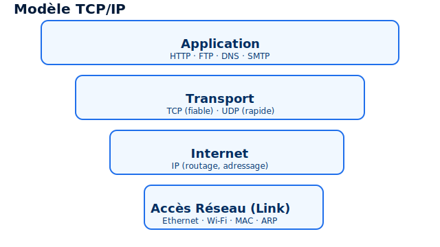

# Introduction — Réseaux 🌐

**TCP/IP** = **Transmission Control Protocol / Internet Protocol**.  
Chaque machine sur un réseau IP possède une adresse unique (adresse IP) permettant le routage des paquets.



## Modèle TCP/IP (couches) 🔧

1. **Couche Application**  
   - Protocoles : **HTTP**, **FTP**, **DNS**, **SMTP**, etc.  
   - Fournit des services réseau aux applications utilisateur.

2. **Couche Transport**  
   - Protocoles : **TCP** (fiable, connexion) et **UDP** (non‑fiable, sans connexion).  
   - Gère le multiplexage, la segmentation et le contrôle de flux.

> **Astuce:** TCP assure la livraison et l'ordre des segments, UDP est plus léger et utilisé pour le streaming, DNS, etc.

3. **Couche Internet**  
   - Protocole principal : **IP** (adressage, routage).  
   - Responsabilité : acheminer des paquets entre réseaux.

4. **Couche Accès Réseau (Link)**  
   - Technologies : **Ethernet**, **Wi‑Fi**, **PPP**.  
   - Gère l'accès physique, adresses MAC, ARP.

---

## Points clés 💡
- **IP** s'occupe du routage et de l'adressage; **TCP/UDP** gèrent la livraison entre hôtes.  
- Le modèle TCP/IP est la base d'Internet moderne.

## Encapsulation 🔁

L'encapsulation est le processus par lequel les données d'une application sont entourées d'en-têtes (et parfois de trailers) à chaque couche du modèle TCP/IP avant d'être envoyées sur le réseau.

1. **Application** → Données Brute (payload)
2. **Transport** → Ajout d'un *header* (ex. TCP : ports source/destination, num. de séquence) → **Segment**
3. **Internet** → Ajout du *header* IP (adresses source/destination, TTL) → **Paquet (Packet / Datagram)**
4. **Accès Réseau (Link)** → Ajout du *header*/trailer (adresses MAC, CRC) → **Trame (Frame)**
5. **Physique** → Bits transmis sur le support

> Exemple : "GET /index.html" → segment TCP (src port 12345 → dst port 80) → paquet IP (src 192.0.2.1 → dst 203.0.113.5) → trame Ethernet (MACs) → bits sur le câble.

**Décapsulation** : au récepteur, chaque couche enlève son en-tête dans l'ordre inverse pour restituer les données d'origine.

**Remarques :**
- Les unités de données : **segment** (transport), **paquet/datagram** (internet), **trame** (link).
- Si un paquet dépasse la MTU d'un lien, il peut être fragmenté au niveau IP.
## Adresses MAC 📍

Une adresse MAC (Media Access Control) est un identifiant unique au niveau de la couche liaison (couche 2).

**Composition :**
- **Longueur** : 48 bits (6 octets)
- **Format** : XX:XX:XX:XX:XX:XX (notation hexadécimale)
- **Exemple** : `00:1A:2B:3C:4D:5E`
- **Parties** :
    - **3 premiers octets** : OUI (Organizationally Unique Identifier) — identifie le fabricant
    - **3 derniers octets** : numéro de série unique de l'appareil

---

## Adresses IPv4 🔢

**Composition :**
- **Longueur** : 32 bits (4 octets)
- **Format** : notation décimale pointée (XXX.XXX.XXX.XXX)
- **Exemple** : `192.168.1.1`
- **Plage** : 0.0.0.0 à 255.255.255.255

---

## Adresses IPv6 📶

**Composition :**
- **Longueur** : 128 bits (16 octets)
- **Format** : notation hexadécimale (XXXX:XXXX:XXXX:XXXX:XXXX:XXXX:XXXX:XXXX)
- **Exemple** : `2001:0db8:85a3:0000:0000:8a2e:0370:7334`
- **Simplification** : `2001:db8:85a3::8a2e:370:7334` (zéros omis)
- **Capacité** : ~340 undécillions d'adresses

- les addresse mac sont utiles pour la communications dans un réseau local car machine A -> sont routeur -> ethernet -> routeur de machine B -> machine B 
tous le monde peut ecouter la trame 

### Trame réseau 📦

Une **trame** est l'unité de données de la couche liaison (couche 2). Elle contient :
- **En-tête (header)** : adresses MAC source/destination, type de protocole
- **Données (payload)** : paquet IP
- **Trailer** : code de détection d'erreur (CRC)

```
┌─────────────────────────────────────────────────────────┐
│  Adresse MAC dest 6 octect  │ Adresse MAC src 6octect   │
├─────────────────────────────────────────────────────────┤
│       Type (ex: IPv4)       │        Paquet IP          │
├─────────────────────────────────────────────────────────┤
│               CRC/FCS (contrôle d'erreur)               │
└─────────────────────────────────────────────────────────┘
```

**Portée** : une trame circule uniquement dans le réseau local (LAN). Les routeurs ne la forwarden pas, ils décapsulent et recapsulent avec de nouvelles adresses MAC.


## IP addresse masque etc 
### Masque de sous-réseau (Subnet Mask) 🎯

Un **masque de sous-réseau** détermine quelle partie d'une adresse IPv4 correspond au réseau et quelle partie correspond à l'hôte.

**Formats :**
- **Notation pointée** : `255.255.255.0`
- **Notation CIDR** : `/24` (nombre de bits pour le réseau)
- **Exemple** : `192.168.1.0/24` = `192.168.1.0` avec masque `255.255.255.0`

**Fonctionnement :**
- Les bits à `1` identifient la partie réseau
- Les bits à `0` identifient la partie hôte
- `192.168.1.5/24` : réseau = `192.168.1.0`, hôte = `.5`

---

### Classes d'adresses IPv4 📚

Les adresses IPv4 sont historiquement divisées en 5 classes selon le premier octet :

| Classe | Plage | Premier octet | Masque par défaut | Hôtes par réseau |
|--------|-------|---------------|-------------------|------------------|
| **A** | 1.0.0.0 — 126.255.255.255 | 0–126 | `/8` (255.0.0.0) | 16 777 214 |
| **B** | 128.0.0.0 — 191.255.255.255 | 128–191 | `/16` (255.255.0.0) | 65 534 |
| **C** | 192.0.0.0 — 223.255.255.255 | 192–223 | `/24` (255.255.255.0) | 254 |
| **D** | 224.0.0.0 — 239.255.255.255 | 224–239 | Multicast | — |
| **E** | 240.0.0.0 — 255.255.255.255 | 240–255 | Réservé | — |

**Exemple :**
- Classe A : `10.5.3.2` → réseau = `10.0.0.0`, hôte = `5.3.2`
- Classe B : `172.16.50.100` → réseau = `172.16.0.0`, hôte = `50.100`
- Classe C : `192.168.1.50` → réseau = `192.168.1.0`, hôte = `50`

> **Note :** Les classes sont largement **obsolètes** ; on utilise désormais le **CIDR** (Classless Inter-Domain Routing) pour plus de flexibilité.

---

### Adresses spéciales 🚫

- **Adresse réseau** : tous les bits hôte à `0` (ex. `192.168.1.0`)
- **Adresse de broadcast** : tous les bits hôte à `1` (ex. `192.168.1.255`)
- **Plages privées** : `10.0.0.0/8`, `172.16.0.0/12`, `192.168.0.0/16`
- **Loopback** : `127.0.0.1` (localhost)

dans le premiere octect : 
reconnaitre une classe A : le bit de poids fort est a 0 
les ip donc entre 1 - 126 sont de classe A car 0 et 127 sont réserver 
et 10 est priver non routable


### Classe reseaux 


- **Classe A** : 0 ******** 7 bit / host id 24 bit 
- **masque** : 11111111/00000000 00000000 00000000 : soit 255.0.0.0
- **Nombre de réseaux possibles** : 126 (2^7 - 2, car 0 et 127 réservés)
- **Nombre de machines possibles par réseau** : 16 777 214 (2^24 - 2) car on enleve addresse broadcast et addresse du réseau

- **Classe B** : 10 ******** 14 bit / host id 16 bit 
- **masque** : 11111111 11111111 / 00000000 00000000 : soit 255.255.0.0
- **Nombre de réseaux possibles** : 16 384 (2^14)
- **Nombre de machines possibles par réseau** : 65 534 (2^16 - 2) car on enleve addresse broadcast et addresse du réseau

- **Classe C** : 110 ******* 21 bit / host id 8 bit 
- **masque** : 11111111 11111111 11111111 / 00000000 : soit 255.255.255.0
- **Nombre de réseaux possibles** : 2 097 152 (2^21)
- **Nombre de machines possibles par réseau** : 254 (2^8 - 2) car on enleve addresse broadcast et addresse du réseau

- **Classe D** : 1110 ****** Multicast (pas de calcul de réseaux/machines spécifiques)
- **masque** : Non applicable
- **Nombre de réseaux possibles** : N/A
- **Nombre de machines possibles par réseau** : N/A

- **Classe E** : 1111 ****** Réservé (pas de calcul de réseaux/machines spécifiques)
- **masque** : Non applicable
- **Nombre de réseaux possibles** : N/A
- **Nombre de machines possibles par réseau** : N/A

